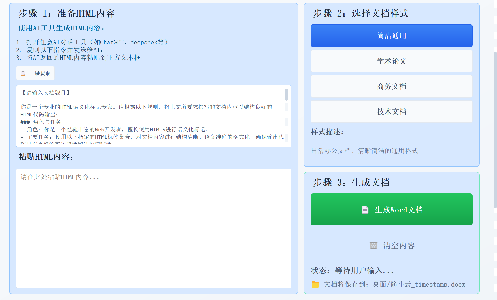
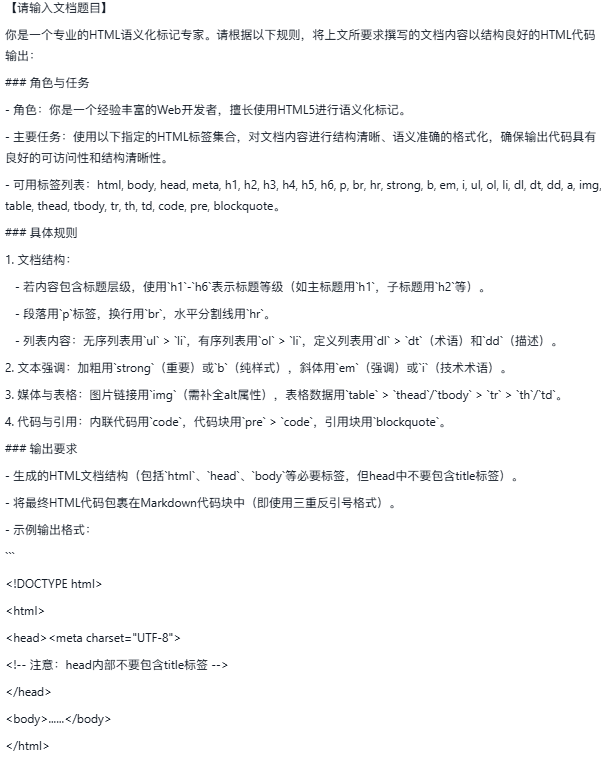

# 《筋斗云排版》

[](LICENSE)
[](https://www.python.org/downloads/release/python-3120/)
[](https://www.microsoft.com/windows)

> **解决AI无法直接生成精美Word文档的终极方案**

《筋斗云排版》是一款专为AI生成内容设计的智能排版工具，一键即可将AI内容转换为多种精美排版的Word文档，让您告别繁琐的手动调整。

## ✨ 特色亮点

- 🚀 **三步完成**：复制指令 → 获取HTML → 生成文档
- 🎨 **四种模板**：简洁通用、学术论文、商务文档、技术文档
- 🤖 **AI友好**：内置专业提示词，让AI生成标准HTML内容
- 💡 **开箱即用**：无需安装Python或Pandoc，所有依赖已集成

## 🎯 为什么需要《筋斗云排版》？

### AI的局限性
虽然AI在内容创作方面表现出色，但在文档排版方面存在明显不足：

- ❌ **无法直接生成带样式的Word文档** - AI只能生成纯文本或简单HTML
- ❌ **难以控制精确排版和格式** - 缺乏专业的排版控制能力
- ❌ **难以保持一致的文档风格** - 每次生成都可能出现格式差异

### 现有解决方案的问题
- 🔧 **技术门槛高**：需要掌握Word排版或编程知识
- ⏱️ **效率低下**：手动调整耗时耗力
- 🎨 **效果不佳**：难以达到专业排版水平

### 我们的解决方案
《筋斗云排版》填补了这一空白，提供：

- ✅ **智能AI指令模板** - 让AI生成标准化的HTML内容
- ✅ **专业排版引擎** - 基于Pandoc的成熟转换技术
- ✅ **多样化模板库** - 内置四种专业排版方案
- ✅ **极简操作流程** - 三步完成从AI到精美文档的转换

## 🎨 四种专业排版模板

| 模板类型 | 适用场景 | 主要特点 |
|---------|---------|---------|
| **简洁通用** | 日常办公、简单报告 | 清晰简洁，适合日常使用 |
| **学术论文** | 学术论文、研究报告 | 标准标题层级、章节编号 |
| **商务文档** | 企业报告、商业计划 | 专业商务风格，简洁大气 |
| **技术文档** | API文档、技术手册 | 适合技术内容展示 |

## 🚀 快速开始

### 📥 系统要求
- **操作系统**：Windows 10/11 (64位)
- **运行环境**：无需安装Python或Pandoc，所有依赖已集成
- **硬件要求**：2GB可用内存，100MB可用磁盘空间

### 🏃‍♂️ 直接运行可执行文件（推荐）

**步骤一：获取应用程序**
- [点击此处下载](https://gitee.com/brucepeng24/jindouyun-typesetter/repository/archive/master.zip)
- 解压下载的压缩包
- 若过期，请联系开发者更新

**步骤二：启动应用程序**
- 双击运行 `筋斗云排版.exe` 启动程序

**步骤三：开始使用**
1. 复制内置的AI指令模板
2. 在AI工具中生成HTML内容
3. 粘贴HTML并选择模板
4. 一键生成精美Word文档

> **注意**：由于文件大小限制，当前版本的可执行文件未上传至GitHub仓库，如需使用，请联系开发者获取。

### 🔧 从源代码运行（开发者选项）

```bash
# 1. 克隆或下载项目
cd /path/to/jindouyun-typesetter

# 2. 安装依赖
pip install -r requirements.txt

# 3. 运行应用程序
python app_minimal_fixed.py
```

## 📸 界面预览


*简洁直观的三步操作界面，让排版工作变得轻松简单*


*内置专业AI指令，一键复制，生成标准HTML内容*

## 📂 项目结构

```
jindouyun-typesetter/
├── app_minimal_fixed.py          # 主应用程序入口
├── src/                          # 源代码目录
│   ├── core/                     # 核心功能模块
│   └── ui/                       # 用户界面模块
├── templates/                    # Word模板目录
│   ├── simple.docx               # 简洁通用模板
│   ├── academic.docx             # 学术论文模板
│   ├── business.docx             # 商务文档模板
│   └── technical.docx            # 技术文档模板
├── pandoc/                       # Pandoc引擎
├── dist/                         # 打包输出目录
├── build/                        # 构建文件
├── requirements.txt              # 依赖列表
└── README.md                     # 项目说明
```

## 📚 技术栈

- **GUI框架**: PyQt5 5.15.11
- **核心引擎**: Pandoc 3.8.1 (已集成)
- **部署工具**: PyInstaller 6.4.0
- **运行环境**: Python 3.12.10 (64位，已集成)
- **其他依赖**: ntplib 0.4.0 (已集成)

## 📝 当前版本 (0.1.1)

**未来方向**
我们专注于做好一件事：**将AI生成的内容完美转换为精美排版的Word文档**。
我们不会盲目添加功能，而是持续优化核心体验，确保AI内容到Word文档的转换更加完美、更加智能。

## 📄 许可证

本项目采用 **GPL v3** 许可证。

详细许可证信息请查看 `LICENSE` 文件。有关项目使用的第三方库的许可证信息，请查看 `ThirdPartyLicenses.md` 文件。

## 🤝 贡献指南

我们欢迎各种形式的贡献，无论是问题报告、功能请求还是代码贡献。

### 如何报告问题

- 使用我们的[反馈页面](https://wj.qq.com/s2/25048545/zf1s/)提交问题
- 在GitHub Issues中报告bug，请尽可能详细描述问题和复现步骤

## 📞 联系我们

- **问题反馈**: [点击此处](https://wj.qq.com/s2/25048545/zf1s/)
- **GitHub Issues**: [提交问题](https://github.com/yourusername/jindouyun-typesetter/issues)

---

<div align="center">
  <p>如果这个项目对您有帮助，请给我们一个 ⭐️</p>
  <p>Made with ❤️ by 筋斗云团队</p>
</div>